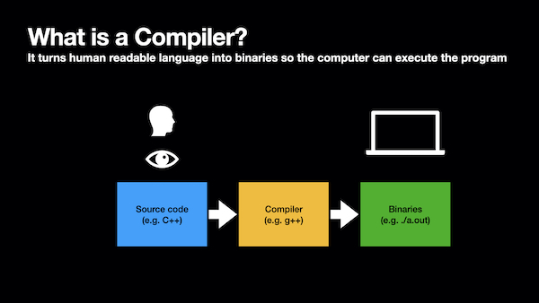

# Class 2
## Homework from last week
Who submitted and who hasn't? Any problems with using replit and slack? 
(Were you able to review the notes link?)

---

## Heat Event Revision
See [notes from last class](https://github.com/miyagi-sensei/twgss/blob/main/class1.md#heat-event-revision).

---

## Generating Primes
1. [What is a function?](https://www.programiz.com/c-programming/c-functions)
2. Refactor homework to an `is_prime(n)` function
3. Use `is_prime(n)` function to generate all prime numbers ≤ `N`
4. Optimizing and impact to runtime performance (only need to check up to square root of `N`)
5. Time Complexity basics
6. Sieve of Eratosthenes
    - Let's say you want a list of all primes ≤ `N`. Create a list of all integers from `2` to `N`.
    - Repeat the following until the list is empty:
        - The smallest integer `p` in the list is prime.
        - Remove all multiples of `p` from the list.
    - Very often, the list is implemented using an array of boolean of size `N`. Initially the array is all `true` (except `0` and `1` which are `false`), meaning that the numbers exist in the list. To delete a number `x`, change the `x`th element of the array to false. Please read the pseudo-code in the [Wikipedia article](https://en.wikipedia.org/wiki/Sieve_of_Eratosthenes) for more details.

## Reminder
- Going forward, do all the coding for this class inside the First Project you created last time. You have sent me the invite link and I have access to it.
- Demonstrate how to send the link to a file in your replit project
- Learn how to manage the folders and organize your code and homework neatly. Here are the [common Linux commands](https://github.com/miyagi-sensei/miyagi-academy/blob/master/README.md#common-linux-commands).
- Don't use the `Run` button in replit. Get used to compiling your code with `g++ code.cpp` and then run it with `./a.out`. That way you can have more files in the same project.

---

## Homework
### Combinatorics
Watch the first 9 videos this [playlist](https://www.youtube.com/playlist?list=PLmdFyQYShrjfPLdHQxuNWvh2ct666Na3z) (up to Selection)
Or the following 9 videos:
1. [Counting](https://youtu.be/0NAASclUm4k)
2. [Forming Numbers 1](https://youtu.be/XPPYYM6WCuE)
3. [Forming Numbers 2](https://youtu.be/W4eeXU_T53o)
4. [Forming Numbers 2](https://youtu.be/HwT32y5MQyo)
5. [Forming Numbers 2](https://youtu.be/2C4CVM5rgxQ)
6. [Arranging People](https://youtu.be/tBQhcP9Zr2E)
7. [Arranging Letters 1](https://youtu.be/htkFH0Fhk-M)
8. [Arranging Letters 2](https://youtu.be/jMx3SqBYuX0)
9. [Selection](https://youtu.be/h6xioUHONj0)

### Rewrite primes generation
Write the prime number generation program yourself from scratch and check that it's correct. Then send me the link to your code like last time.
